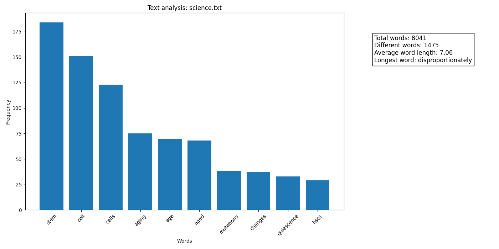
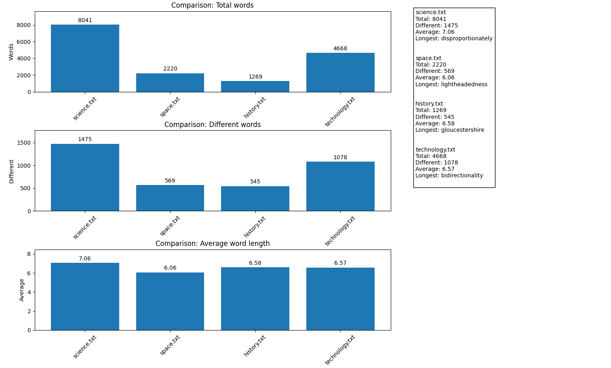

# Text Analyzer (Python)

A Python desktop application that analyzes text files and visualizes word statistics.  
The program can analyze a single `.txt` file or compare multiple files from a folder.

---

## Preview

### Single File Analysis


### Multiple File Comparison


---

## Features

- Analyze a single text file or multiple files
- Automatic text cleaning (removes punctuation and converts text to lowercase)
- Removal of common stop words (Romanian and English)
- Word frequency calculation
- Statistics generation:
  - Total number of words
  - Number of different words
  - Average word length
  - Longest word
- Visualization using bar charts
- Comparison between multiple text files

---

## Technologies Used

- Python 3.10+
- Tkinter (file selection interface)
- Matplotlib (data visualization)

---

## Installation

```bash
pip install -r requirements.txt
```
---
## Project structure
```bash
text-analyzer/
│
├── images/                 # Image assets
├── texts/                  # Text data / input files
│
├── .gitattributes          # Git configuration
├── .gitignore              # Ignored files
├── README.md               # Project documentation
├── requirements.txt        # Dependencies
│
├── stop_words.py           # Stop words handling
├── text_analyzer.py        # Main analysis logic
```
---

## How the Program Works

1. The program asks the user to choose the analysis mode:
   - Single text file
   - Entire folder of text files
2. The user selects the file or folder using a file picker window.
3. The program processes the text:
   - removes punctuation
   - converts text to lowercase
   - splits text into words
   - removes common stop words
4. Statistics are computed for each file.
5. Results are displayed:
- in the terminal
- as graphical charts using Matplotlib

---

## Example Usage

Run the program:
```bash
python text_analyzer.py
```
Then:
- choose analysis mode
- select the desired file or folder
- view the generated statistics and charts

---

## Example Statistics

For each text file the program calculates:
- Total words
- Different words
- Average word length
- Longest word

When multiple files are analyzed, the program creates comparison charts for:
- Total words
- Different words
- Average word length

---

## What I learned 

- Text cleaning and preprocessing in Python
- Stop word filtering (Romanian and English)
- Word frequency analysis
- Data visualization with Matplotlib
- File and folder handling with Tkinter

---

## Text Sources

The text samples for testing and demonstration come from:

**Space**
https://www.nasa.gov/missions/artemis/nasas-artemis-ii-moon-mission-daily-agenda/

**History**
https://www.english-heritage.org.uk/learn/story-of-england/medieval/

**Technology**
https://scispace.com/pdf/language-models-are-few-shot-learners-2fg8gvia7m.pdf

**Science**
https://www.cell.com/cell-stem-cell/fulltext/S1934-5909(25)00226-7

---

## Possible Improvements

- support for more languages
- advanced NLP processing
- word clouds
- exporting results to CSV or JSON
- improved graphical interface

---

## Author

Alexandra Blaga
Computer Science Student

---

## License

This project is for educational purposes.
